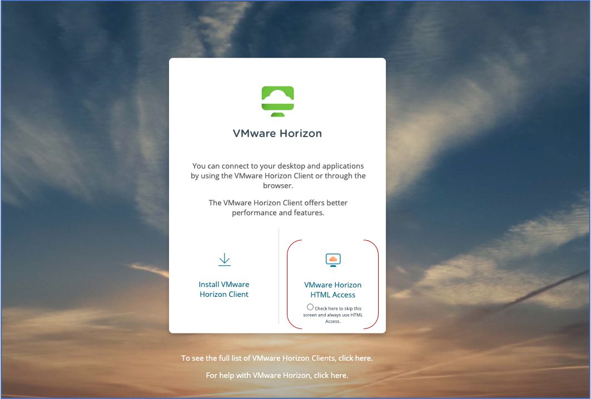
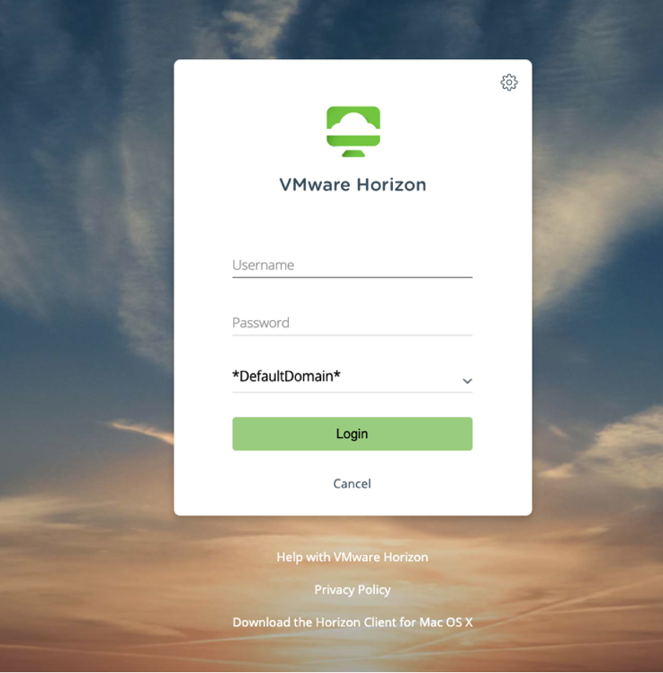
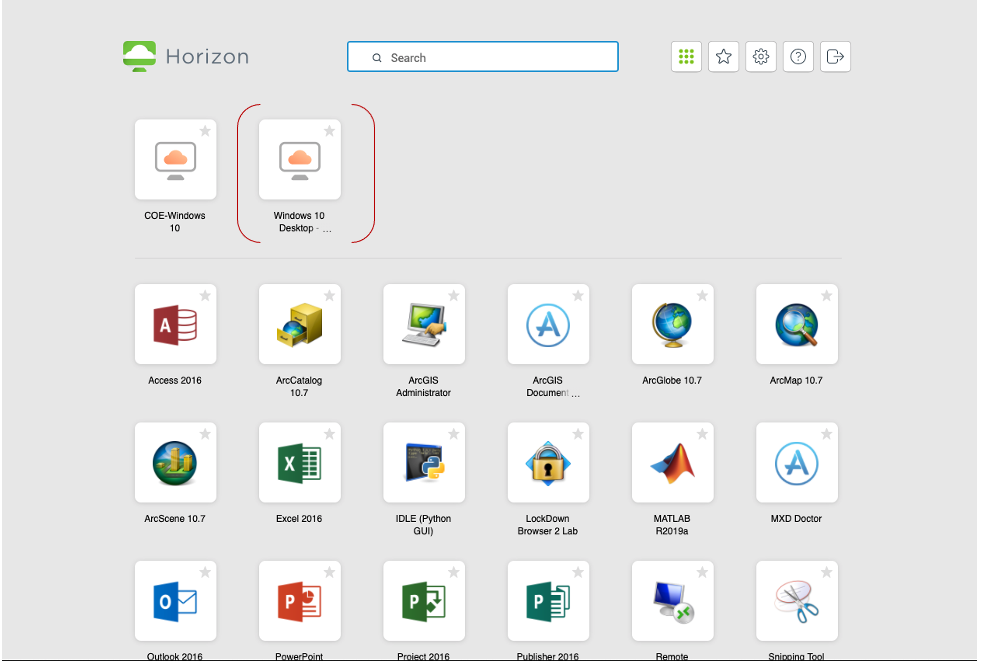
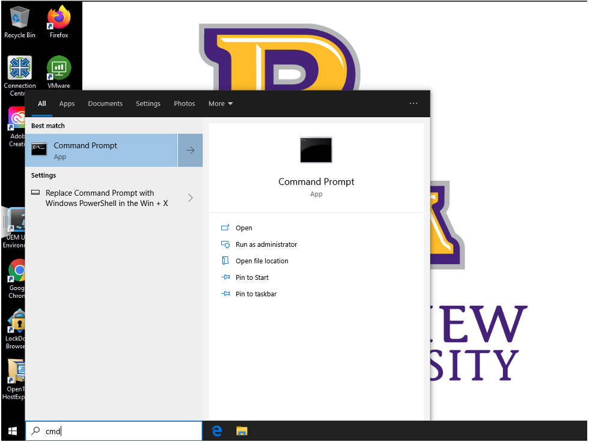
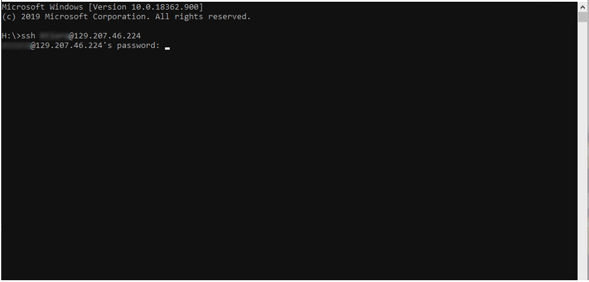
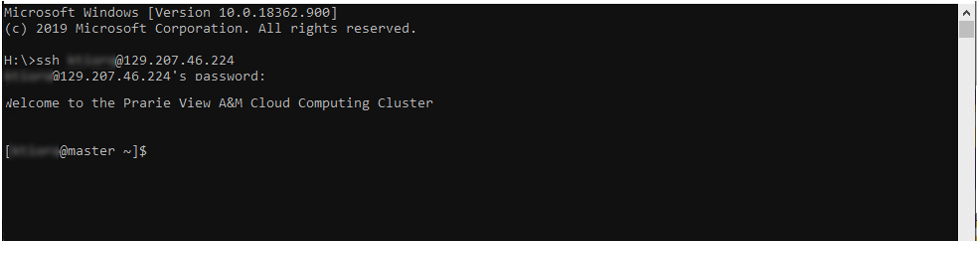

# HPC Account Basics
HOW TO CONNECT TO PVAMU CLOUD CLUSTER USING VMWARE HORIZON HTML ACCESS.

Step 1: 
connect to https://mydesktop.pvamu.edu/ and Click on VMware Horizon HTML Access

Step 2:
 Log in using your PV username and your password

  

Step 3:
 After you logged in, click on windows 10 Desktop

 

Step 4: 

At this point, you should have access to your desktop. Type to search CMD and launch the command line.
 

Step 5: 

Once launched, type the command line below:
ssh username@129.207.46.224

For example: If you PV email is jdoe@student.pvamu.edu, 
type  ssh jdoe@129.207.46.224

 

Then type the default password pvamu1234

You should have the following page :

 

CONGRATULATIONS! YOU HAVE SUCCESFULLY LOGGED IN THE PRAIRIE VIEW A&M CLOUD CLUSTER.

